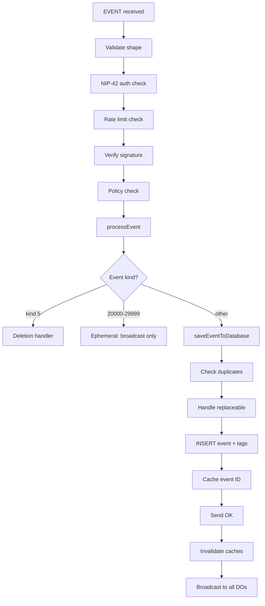
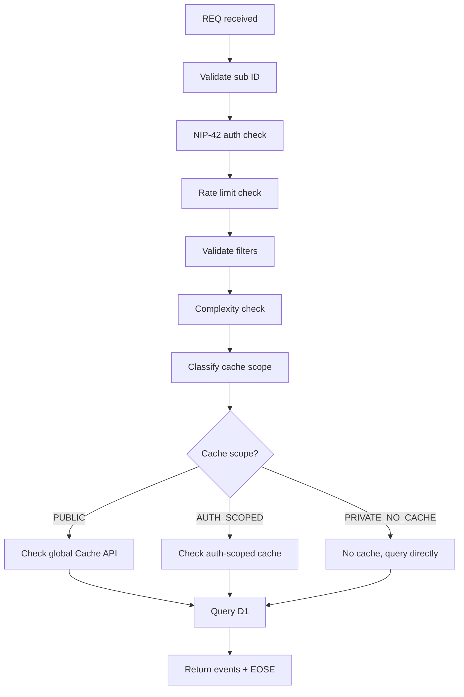
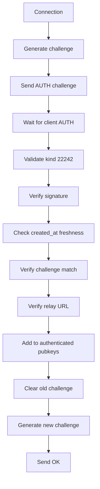

# Architecture

## Overview

```
                    HTTP Request
                         │
                         ▼
              ┌──────────────────┐
              │  Worker Handler  │  (src/relay-worker.ts)
              │  - HTTP routing  │
              │  - NIP-11        │
              │  - Health        │
              │  - DB init       │
              │  - Landing page  │
              └────────┬─────────┘
                       │
          ┌────────────┼────────────┐
          │            │            │
    WebSocket    Relay Info    HTTP API
    Upgrade      JSON          (health, NIP-05)
          │
          ▼
┌──────────────────────┐
│  Durable Object      │  (src/durable-object.ts)
│  - WebSocket sessions│
│  - NIP-42 auth       │
│  - Subscriptions     │
│  - Broadcasting      │
│  - Query caching     │
│  - Rate limiting     │
└──────────┬───────────┘
           │
    ┌──────┴──────┐
    │             │
    ▼             ▼
┌──────┐    ┌──────────┐
│  D1  │    │ Cache API│
│  DB  │    │ (global) │
└──────┘    └──────────┘
```

## Data Flow

### EVENT Ingest



### REQ Flow



### AUTH Flow



## Module Layout

```
src/
├── index.ts              Entry point
├── config.ts             Operator configuration
├── types.ts              Core Nostr types
├── relay-worker.ts       HTTP worker handler
├── durable-object.ts     WebSocket DO
│
├── config/
│   ├── defaults.ts       Safe default values
│   └── schema.ts         Runtime validation
│
├── shared/
│   ├── hex.ts            Hex encoding utilities
│   └── logger.ts         Structured logging
│
├── relay/
│   ├── crypto/           Signature verification, hashing
│   ├── protocol/         Event/filter validation
│   ├── policy/           Content moderation policy
│   ├── rate-limit/       Token bucket rate limiting
│   ├── cache/            Cache classification
│   ├── queries/          Query complexity analysis
│   ├── services/         Extension registry
│   └── storage/          Storage interfaces
│
├── worker/
│   └── health.ts         Health check endpoint
│
└── future-protocols/     Domain protocol extensions
```

## Key Design Decisions

1. **D1 for persistence**: SQLite via Cloudflare D1 with read replication
2. **Durable Objects for WebSockets**: 9-region mesh for low-latency connections
3. **WebSocket Hibernation**: Cost optimization for idle clients
4. **Cache classification**: PUBLIC / AUTH_SCOPED / PRIVATE_NO_CACHE
5. **Token bucket rate limiting**: Multi-dimensional, identity-aware
6. **Query complexity protection**: Pre-execution cost estimation
7. **Extension registry**: Domain protocols plug in without modifying core
